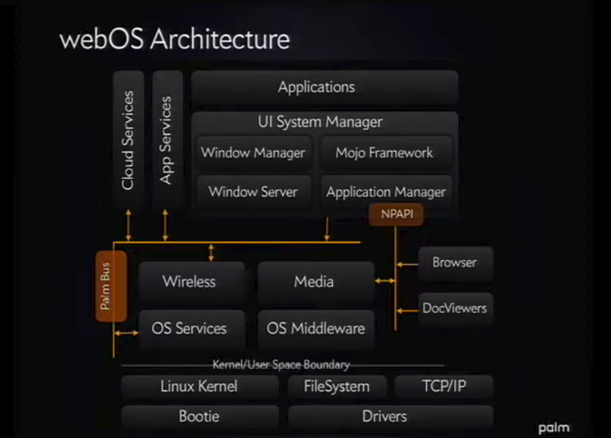

# webOS architecture

A slide from a **Palm** presentation, contemporary with this code. Kept as study
material: it is the map you can place every component of the monorepo against.

## How it maps onto this repository

| Box in the diagram | Components | State on modern Debian |
|---|---|---|
| **Palm Bus** (the orange column) | `luna-service2` | builds |
| **OS Services / OS Middleware** | `pmloglib`, `nyx-lib`, `libsandbox`, `jemalloc`, `filecache`, `db8`, `configurator`, `luna-prefs`, `luna-init`, `librolegen`, `pmstatemachineengine` | build |
| **App Services** | `luna-universalsearchmgr`, `mojomail`, `activitymanager` | build; the JS ones need node |
| **UI System Manager** | `luna-sysmgr-ipc`, `luna-sysmgr-ipc-messages` and **`LunaSysMgr`** | builds and runs |
| **Browser / DocViewers** (over NPAPI) | `BrowserServer`, `BrowserAdapter`, WebKit | replaced, not ported: see below |
| **Media / Wireless** | — | HP never released them |
| Everything below *Kernel/User Space Boundary* | — | out of scope: no kernel, no drivers |

## Three things the diagram makes clear

**The bus is the spine, literally.** It is drawn as the vertical bar everything
else plugs into. It survived intact all the way to LG's webOS.

**"UI System Manager" is four boxes in a single process.** Window Manager,
Window Server, Mojo Framework and Application Manager all live inside
`LunaSysMgr`, and they line up with its largest files:
`ApplicationManagerService.cpp` (4,536 lines), `WindowServerLuna.cpp`,
`WindowServer.cpp`.

**NPAPI is the boundary to the browser.** The diagram puts Browser and
DocViewers OUTSIDE the UI System Manager. That is why `LunaSysMgr` does not
include a single WebKit header and talks to the engine over IPC:
`BrowserAdapter` is, literally, an NPAPI plugin. The practical consequence is
that the web engine can be replaced without touching the window manager.

That is not a hypothetical here: it is what was done. Chromium has no plugin
socket, so `BrowserServer` and `BrowserAdapter` (~29k lines between them) are
not ported at all. In their place, `QWebPage::embedPage` paints one page inside
another — the browser app's dead `<object type="application/x-palm-browser">`
becomes a hole that a second web view is blitted into — and `BrowserViewAdapter`
answers the app's `goBack`, `reload`, `setUrl` and the rest straight to
QtWebEngine. The window manager never learned about any of it, exactly as the
diagram promises.

**And where the gaps are:** the *Media* and *Wireless* boxes are exactly where
`media-api`, `hid` and `hal` live — the libraries HP never released. The diagram
draws the boxes; in the CE release they are empty. See
[code-survey.md](code-survey.md).
